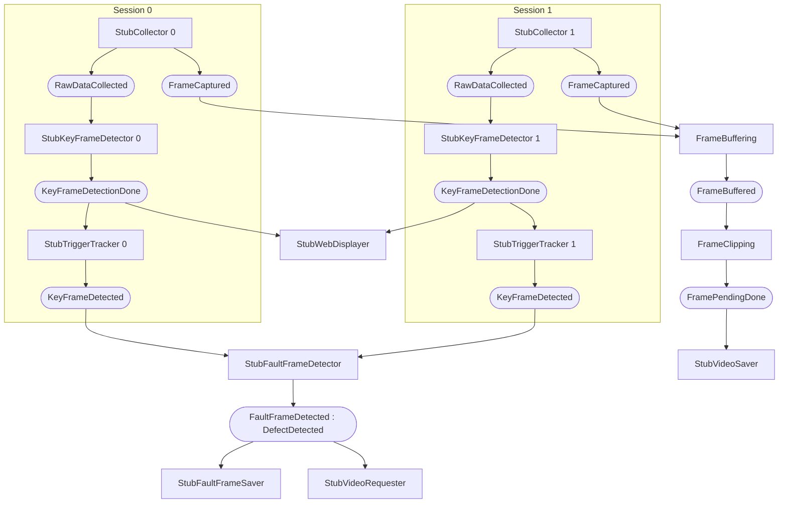

# Event Flow

```mermaid
graph TD
    haf34c0[StubFaultFrameDetector]
    haf2f80[StubFaultFrameSaver]
    haf30d0[StubVideoRequester]
    haf3370[StubWebDisplayer]
    haf2a40[FrameBuffering]
    haf2e30[FrameClipping]
    haf3220[StubVideoSaver]
    ev3([FaultFrameDetected : DefectDetected])
    ev5([FrameBuffered])
    ev6([FramePendingDone])

    subgraph "Session 0"
        haf3610[StubCollector 0]
        haf3760[StubKeyFrameDetector 0]
        haf38b0[StubTriggerTracker 0]
        ev0([RawDataCollected])
        ev1([KeyFrameDetectionDone])
        ev2([KeyFrameDetected])
        ev4([FrameCaptured])
    end
    subgraph "Session 1"
        hb1e610[StubCollector 1]
        hb1e750[StubKeyFrameDetector 1]
        hb1e890[StubTriggerTracker 1]
        ev7([RawDataCollected])
        ev8([KeyFrameDetectionDone])
        ev9([KeyFrameDetected])
        ev10([FrameCaptured])
    end

    haf3610 --> ev0
    ev0 --> haf3760
    haf3760 --> ev1
    ev1 --> haf38b0
    ev1 --> haf3370
    haf38b0 --> ev2
    ev2 --> haf34c0
    haf34c0 --> ev3
    ev3 --> haf2f80
    ev3 --> haf30d0
    haf3610 --> ev4
    ev4 --> haf2a40
    haf2a40 --> ev5
    ev5 --> haf2e30
    haf2e30 --> ev6
    ev6 --> haf3220
    hb1e610 --> ev7
    ev7 --> hb1e750
    hb1e750 --> ev8
    ev8 --> hb1e890
    ev8 --> haf3370
    hb1e890 --> ev9
    ev9 --> haf34c0
    hb1e610 --> ev10
    ev10 --> haf2a40
```
