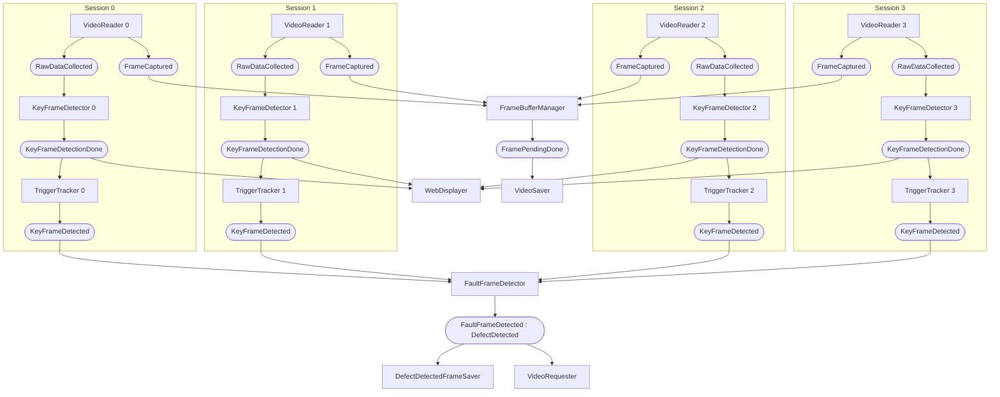

# Event Flow

```mermaid
graph TD
    hf7afdc[FaultFrameDetector]
    hec655c[DefectDetectedFrameSaver]
    hec6bec[VideoRequester]
    hec6d3c[WebDisplayer]
    hec66ac[FrameBufferManager]
    hec6a9c[VideoSaver]
    ev3([FaultFrameDetected : DefectDetected])
    ev5([FramePendingDone])

    subgraph "Session 0"
        hec5ecc[VideoReader 0]
        hf7b27c[KeyFrameDetector 0]
        hf7b3cc[TriggerTracker 0]
        ev0([RawDataCollected])
        ev1([KeyFrameDetectionDone])
        ev2([KeyFrameDetected])
        ev4([FrameCaptured])
    end
    subgraph "Session 1"
        he8a0ec[VideoReader 1]
        hf8a86c[KeyFrameDetector 1]
        hf8aaec[TriggerTracker 1]
        ev6([RawDataCollected])
        ev7([KeyFrameDetectionDone])
        ev8([KeyFrameDetected])
        ev9([FrameCaptured])
    end
    subgraph "Session 2"
        he8a5ec[VideoReader 2]
        hf8ac2c[KeyFrameDetector 2]
        hf8ad6c[TriggerTracker 2]
        ev10([RawDataCollected])
        ev11([KeyFrameDetectionDone])
        ev12([KeyFrameDetected])
        ev13([FrameCaptured])
    end
    subgraph "Session 3"
        he23a6c[VideoReader 3]
        h03c75d[KeyFrameDetector 3]
        h03caed[TriggerTracker 3]
        ev14([RawDataCollected])
        ev15([KeyFrameDetectionDone])
        ev16([KeyFrameDetected])
        ev17([FrameCaptured])
    end

    hec5ecc --> ev0
    ev0 --> hf7b27c
    hf7b27c --> ev1
    ev1 --> hf7b3cc
    ev1 --> hec6d3c
    hf7b3cc --> ev2
    ev2 --> hf7afdc
    hf7afdc --> ev3
    ev3 --> hec655c
    ev3 --> hec6bec
    hec5ecc --> ev4
    ev4 --> hec66ac
    hec66ac --> ev5
    ev5 --> hec6a9c
    he8a0ec --> ev6
    ev6 --> hf8a86c
    hf8a86c --> ev7
    ev7 --> hf8aaec
    ev7 --> hec6d3c
    hf8aaec --> ev8
    ev8 --> hf7afdc
    he8a0ec --> ev9
    ev9 --> hec66ac
    he8a5ec --> ev10
    ev10 --> hf8ac2c
    hf8ac2c --> ev11
    ev11 --> hf8ad6c
    ev11 --> hec6d3c
    hf8ad6c --> ev12
    ev12 --> hf7afdc
    he8a5ec --> ev13
    ev13 --> hec66ac
    he23a6c --> ev14
    ev14 --> h03c75d
    h03c75d --> ev15
    ev15 --> h03caed
    ev15 --> hec6d3c
    h03caed --> ev16
    ev16 --> hf7afdc
    he23a6c --> ev17
    ev17 --> hec66ac
```
