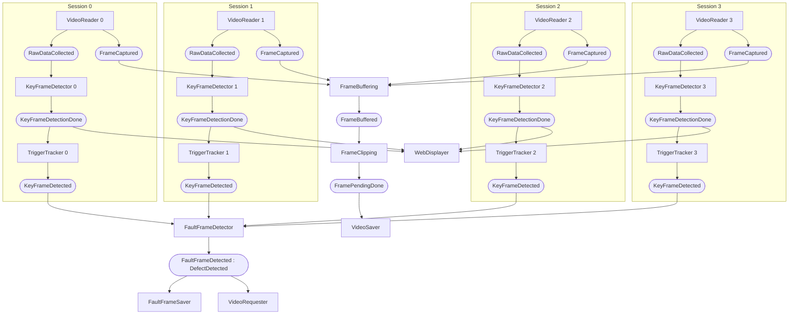

# Event Flow

```mermaid
graph TD
    h15937f[FaultFrameDetector]
    he0ccee[FaultFrameSaver]
    he0ce3e[VideoRequester]
    he0d0de[WebDisplayer]
    he0c7ae[FrameBuffering]
    he0cb9e[FrameClipping]
    he0cf8e[VideoSaver]
    ev3([FaultFrameDetected : DefectDetected])
    ev5([FrameBuffered])
    ev6([FramePendingDone])

    subgraph "Session 0"
        h1598bf[VideoReader 0]
        h159b5f[KeyFrameDetector 0]
        h159caf[TriggerTracker 0]
        ev0([RawDataCollected])
        ev1([KeyFrameDetectionDone])
        ev2([KeyFrameDetected])
        ev4([FrameCaptured])
    end
    subgraph "Session 1"
        h11617f[VideoReader 1]
        h21a57f[KeyFrameDetector 1]
        h21a7ff[TriggerTracker 1]
        ev7([RawDataCollected])
        ev8([KeyFrameDetectionDone])
        ev9([KeyFrameDetected])
        ev10([FrameCaptured])
    end
    subgraph "Session 2"
        h21abbf[VideoReader 2]
        h21ae3f[KeyFrameDetector 2]
        h21af7f[TriggerTracker 2]
        ev11([RawDataCollected])
        ev12([KeyFrameDetectionDone])
        ev13([KeyFrameDetected])
        ev14([FrameCaptured])
    end
    subgraph "Session 3"
        h1d7acf[VideoReader 3]
        h1d7e5f[KeyFrameDetector 3]
        h1d80bf[TriggerTracker 3]
        ev15([RawDataCollected])
        ev16([KeyFrameDetectionDone])
        ev17([KeyFrameDetected])
        ev18([FrameCaptured])
    end

    h1598bf --> ev0
    ev0 --> h159b5f
    h159b5f --> ev1
    ev1 --> h159caf
    ev1 --> he0d0de
    h159caf --> ev2
    ev2 --> h15937f
    h15937f --> ev3
    ev3 --> he0ccee
    ev3 --> he0ce3e
    h1598bf --> ev4
    ev4 --> he0c7ae
    he0c7ae --> ev5
    ev5 --> he0cb9e
    he0cb9e --> ev6
    ev6 --> he0cf8e
    h11617f --> ev7
    ev7 --> h21a57f
    h21a57f --> ev8
    ev8 --> h21a7ff
    ev8 --> he0d0de
    h21a7ff --> ev9
    ev9 --> h15937f
    h11617f --> ev10
    ev10 --> he0c7ae
    h21abbf --> ev11
    ev11 --> h21ae3f
    h21ae3f --> ev12
    ev12 --> h21af7f
    ev12 --> he0d0de
    h21af7f --> ev13
    ev13 --> h15937f
    h21abbf --> ev14
    ev14 --> he0c7ae
    h1d7acf --> ev15
    ev15 --> h1d7e5f
    h1d7e5f --> ev16
    ev16 --> h1d80bf
    ev16 --> he0d0de
    h1d80bf --> ev17
    ev17 --> h15937f
    h1d7acf --> ev18
    ev18 --> he0c7ae
```
